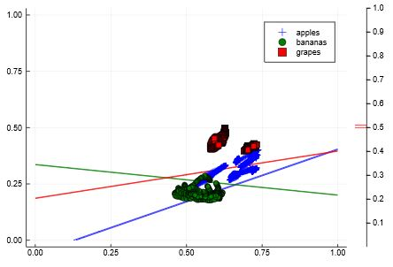

# Non-Binary-Classification-Model-using-Julia-Flux

I did the "**Deep Learning with Flux**" course provided by **Julia Academy** (https://juliaacademy.com/courses/). I express my sincere gratitude to **Dr. Matt Bauman** for presenting this course and sharing the associated Jupyter Notebook. This notebook is associated with second lecture "**Introduction to Neural Networks**" of the mentioned course.

As I was attending the lecture, I realized I need to code myself to understand and record my inferences and in the process came up with this working notebook. Intent is to have this for my future reference as well as be useful to someone new to the field learning ML/DL.

This notebook provides a quick introduction to **Neural Networks** by having a **Non Binary Classification Model** implemented to **classify Apples, Bananas and Grapes Images**. 

Details of what this notebook covers is listed below:
- How to setup the Environment
- Where to get the datasets from 
- Which packages to install and how
- Understanding Multiple Output Model
- Quick recap on Matrix Multiplication
- Prepare input data for the model
- Quick Introduction to One Hot Vectors
- Prepare output labels for the input data
- Define the model
- Train the model and visualize the results

**Model used here is quite simple to help understand the concept of multiple outputs.** However, note it is not able to encapsulate the classes uniquely (refer below decision boundaries... red/green/blue do not have only one respective class on one side). **The model needs to be more complicated to handle this complexity.**

